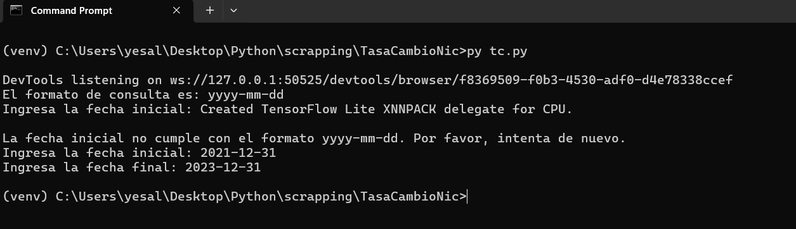

# automatizacion_python_selenium_tc

# Automatización 
## Python-Selenium

Este proyecto de automatización fue realizado como prueba tecnica, abre la pagina de inicio de [https://www.bcn.gob.ni/IRR/tipo_cambio_mensual/index.php](https://www.bcn.gob.ni/IRR/tipo_cambio_mensual/index.php)

Navega hacia la sección de contacto, completa el formulario ingresando un email falso y comprueba que el email se haya validado como incorrecto.

Se realizo utilizando: unittest, Selenium WebDriver y HtmlTestRunner para generar un reporte del test.

### Clonar y Ejecutar Proyecto

Sigue los siguientes pasos para clonar y ejecutar este proyecto en tu entorno local.

### Requisitos previos

1. [Python](https://www.python.org/) - Asegúrate de tener Python instalado, que incluye pip para administrar las dependencias del proyecto.

3. [Git](https://git-scm.com/) - Necesitarás Git para clonar el repositorio.

## Pasos para clonar y ejecutar el proyecto

1. **Clonar el repositorio:**
   Abre tu terminal (o línea de comandos) y ejecuta el siguiente comando para clonar el proyecto desde GitHub:

   ```bash data-copyable
    git clone https://github.com/Yesner/automatizacion_python_selenium_tc.git

2. **Prepara tu entorno virtual** 
  
   ```python data-copyable
    python -m venv venv

   
3. **Instalar dependencias:**
    
    ```bash data-copyable
   !pip install selenium   

4. **Ejecutar el proyecto:**

    ```bash data-copyable
    py tc.py

    

5. **Resultado:**

[Data](Results/datos.csv)