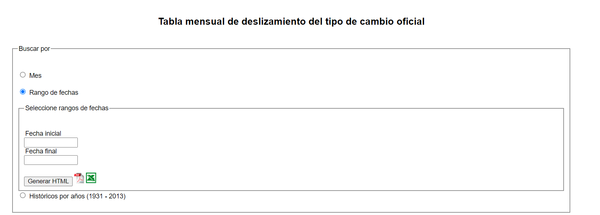

# automatizacion_python_selenium_tc

# Automatización 
## Python-Selenium

Este proyecto de automatización fue realizado como prueba tecnica, abre la pagina de inicio de [https://www.bcn.gob.ni/IRR/tipo_cambio_mensual/index.php](https://www.bcn.gob.ni/IRR/tipo_cambio_mensual/index.php)

Navega hacia el formulario de tabla mensual de deslizamiento del tipo de cambio oficial, rango de fechas y seguidamente estableces el rango que deseas descargar, considerando que:

- Existe un Históricos por años (1931 - 2013))
- A partir del 31 de Diciembre de 2023, la Tasa de Cambio se mantiene en C$36.6243.



### Clonar y Ejecutar Proyecto

Sigue los siguientes pasos para clonar y ejecutar este proyecto en tu entorno local.

### Requisitos previos

1. [Python](https://www.python.org/) - Asegúrate de tener Python instalado, que incluye pip para administrar las dependencias del proyecto.

3. [Git](https://git-scm.com/) - Necesitarás Git para clonar el repositorio.

## Pasos para clonar y ejecutar el proyecto

1. **Clonar el repositorio:**
   Abre tu terminal (o línea de comandos) y ejecuta el siguiente comando para clonar el proyecto desde GitHub:

   ```bash data-copyable
    git clone https://github.com/Yesner/automatizacion_python_selenium_tc.git

2. **Prepara tu entorno virtual** 
  
   ```python data-copyable
    python -m venv venv

   
3. **Instalar dependencias:**
    
    ```bash data-copyable
   !pip install selenium   

4. **Ejecutar el proyecto:**

    ```bash data-copyable
    py tc.py

5. **Resultado:**


[Data](Results/datos.csv)

[Notebook](Resultado_Carga_Datos.ipynb)